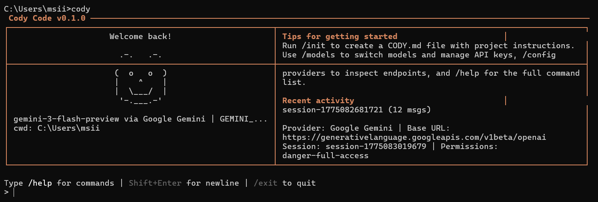

# Cody Code



This repository contains a working Rust CLI for `cody`.

## Attribution

This project started from a local clone of:

`https://github.com/instructkr/claw-code`

The repository was then modified, cleaned up, and extended independently for personal/public use. The current public tree reflects those local modifications and cleanup work.

## What Is Included

- `rust/` - the active Rust workspace and CLI implementation

## Rust Quick Start

```bash
cd rust
cargo build --release
./target/release/cody
```

If `cody` is not on your `PATH`, run the binary directly from `rust/target/debug/` or `rust/target/release/`, or use:

```bash
cargo run -p cody-cli --bin cody
```

## Notes

- Local session state, generated caches, build output, and machine-specific settings are ignored from version control.
- Secrets and local API keys should be supplied through environment variables or local ignored config only.
- This repository is not presented as an official upstream source.

## License

Review the repository contents and choose the license you want to publish with before pushing publicly.
